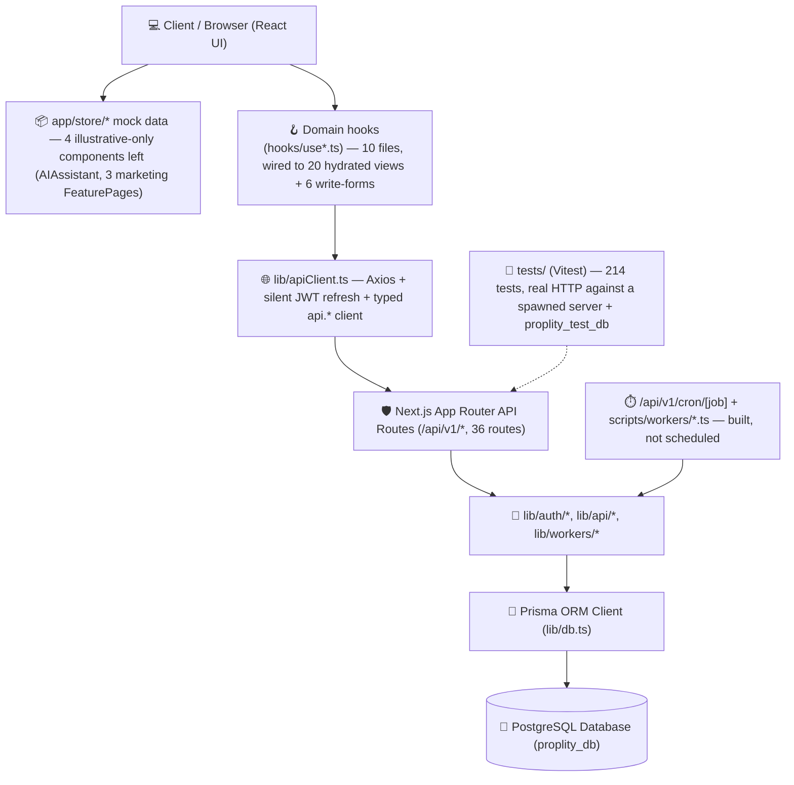

# 🏛️ Proplity — Full Project & File Structure Reference

> **Proplity** is a modern, enterprise-grade AI-powered Property Management & Tenant Experience Platform built on **Next.js 16.3.2 (App Router)**, **TypeScript**, **PostgreSQL 18**, and **Prisma ORM v7**.
>
> **Last updated:** 2026-08-23, after the full domain-API roadmap (Phase 0-pre through Phase 8), Phase 9 frontend read-path hydration, and Phase 10's automated test suite. The app is real routes end to end — there is no client-side router component; every screen is a real Next.js route backed by a real API route.

---

## 🧭 High-Level Architecture Overview



---

## 🌳 Comprehensive File Tree

```
proplity/
├── 📁 app/                                   # Next.js App Router root — every screen is a real route
│   ├── 📄 layout.tsx                        # Root HTML/Body layout with theme providers
│   ├── 📄 page.tsx                          # "/" — public landing (redirects authenticated users to /dashboard or /admin)
│   ├── 📄 HomeLanding.tsx                   # Client wrapper giving LandingPage router-based nav callbacks
│   ├── 📄 globals.css                       # Global Tailwind CSS tokens, animations & base styles
│   │
│   ├── 📁 login/, register/, forgot-password/, verify-email/   # Public auth screens (real routes)
│   ├── 📁 about/, contact/, pricing/, checkout/                # Public marketing/checkout pages
│   ├── 📁 for-landlords/, for-tenants/, for-vendors/            # Marketing feature pages
│   ├── 📁 properties/[id]/                  # Public property detail
│   │
│   ├── 📁 dashboard/                        # Authenticated shell for MANAGER/LANDLORD/TENANT/VENDOR
│   │   ├── 📄 layout.tsx                    # getServerSession() guard + <DashboardChrome>
│   │   ├── 📄 DashboardChrome.tsx           # Header/sidebar shell, role-based tabs, dev-only RoleSwitcher
│   │   ├── 📄 navigateToPage.ts             # Legacy Page-union → real route mapping, shared by ~10 leaf components
│   │   ├── 📁 discover/, messages/, payment-history/, neighbourhood-report/
│   │   ├── 📁 maintenance/, maintenance/[id]/, maintenance-request/new/, tenant-maintenance/
│   │   ├── 📁 tenants/, tenants/add/, tenants/[id]/
│   │   ├── 📁 properties/new/, properties/[id]/, properties/[id]/apply/, properties/[id]/schedule-viewing/
│   │   ├── 📁 vendor/jobs/[id]/, vendor/jobs/[id]/invoice/
│   │   └── 📁 breakdown/[type]/
│   │
│   ├── 📁 admin/                            # Authenticated shell for ADMIN only
│   │   ├── 📄 layout.tsx                    # getServerSession() + role==='ADMIN' guard
│   │   ├── 📄 AdminChrome.tsx
│   │   ├── 📁 reports/
│   │   └── 📁 breakdown/[type]/
│   │
│   ├── 📁 api/v1/                           # Backend REST API — 36 route.ts files
│   │   ├── 📁 auth/                         # login, logout, me, refresh, register, verify-email, change-password (7)
│   │   ├── 📁 properties/                   # +[id], .../units, .../units/[unitId], .../reviews, .../viewings, .../neighbourhood-report (7)
│   │   ├── 📁 maintenance/                  # categories, requests, requests/[id], requests/[id]/rating, schedules (5)
│   │   ├── 📁 leases/                       # +[id], .../notices, .../notes (4)
│   │   ├── 📁 invoices/                     # +[id] (2)
│   │   ├── 📁 payments/                     # initialize, webhook, autopay (3)
│   │   ├── 📁 access-codes/                 # +[id], .../verify (3)
│   │   ├── 📁 conversations/                # +[id]/messages (2)
│   │   ├── 📁 vendors/                      # vendor reputation listing, ADMIN/MANAGER/LANDLORD (1, Phase 9.3a)
│   │   ├── 📁 admin/users/                  # platform-wide user listing, ADMIN only (1, Phase 9.6)
│   │   └── 📁 cron/[job]/                   # dispatches to the 5 lib/workers/* functions (1)
│   │
│   ├── 📁 components/                       # UI Views & Feature Components (37 top-level + Auth/, figma/, ui/)
│   │   ├── 📁 Auth/                         # Login.tsx, Register.tsx, ForgotPassword.tsx
│   │   ├── 📁 figma/                        # ImageWithFallback.tsx
│   │   ├── 📁 ui/                           # ~45 Radix UI + Tailwind design-system primitives (unchanged since project start)
│   │   ├── 📄 AboutPage.tsx, ContactPage.tsx, PricingPage.tsx, LandingPage.tsx
│   │   ├── 📄 AdminDashboard.tsx, AdminBreakdownPage.tsx, AdminReports.tsx           # ✅ real data (Phase 9.6)
│   │   ├── 📄 Dashboard.tsx, DashboardBreakdownPage.tsx                              # ✅ real data (Phase 9.3a/3b)
│   │   ├── 📄 LandlordDashboard.tsx                                                  # ✅ real data (Phase 9.3b)
│   │   ├── 📄 LandlordFeaturePage.tsx                                                # mock — marketing page, out of Phase 9 scope
│   │   ├── 📄 TenantDashboard.tsx, TenantDetail.tsx,
│   │   │      TenantManagement.tsx, TenantMaintenanceRequests.tsx, TenantPaymentHistory.tsx  # ✅ real data (Phase 9.2/3a)
│   │   ├── 📄 TenantFeaturePage.tsx                                                  # mock — marketing page, out of Phase 9 scope
│   │   ├── 📄 VendorDashboard.tsx, VendorJobDetail.tsx                               # ✅ real data (Phase 9.4)
│   │   ├── 📄 ServiceProviderFeaturePage.tsx                                         # mock — marketing page, out of Phase 9 scope
│   │   ├── 📄 MaintenanceBoard.tsx, MaintenanceDetail.tsx                            # ✅ real data (Phase 9.3a)
│   │   ├── 📄 MessagingPortal.tsx, NeighbourhoodReport.tsx                           # ✅ real data (Phase 9.5/9.2)
│   │   ├── 📄 AIAssistant.tsx                                                        # mock — no real AI capability to back it
│   │   ├── 📄 PropertyDetail.tsx, PropertyDiscovery.tsx, PublicPropertyDetail.tsx     # ✅ real data (Phase 9.1/3b)
│   │   ├── 📄 PropertyApplicationForm.tsx, Checkout.tsx, RoleSwitcher.tsx, Logo.tsx
│   │   ├── 📄 MaintenanceRequestForm.tsx    # ✅ wired to POST /maintenance/requests (Phase 7)
│   │   ├── 📄 ScheduleViewing.tsx           # ✅ wired to POST /properties/[id]/viewings (Phase 7)
│   │   ├── 📄 ListProperty.tsx              # ✅ wired to POST /properties + /units (Phase 7)
│   │   ├── 📄 VendorCreateInvoice.tsx       # ✅ wired to POST /invoices (Phase 7) — flagged: never PATCHes the job to COMPLETED
│   │   └── 📄 AddTenantForm.tsx             # ✅ wired to POST /leases, incl. tenant-invite flow (Phase 7)
│   │
│   └── 📁 store/                            # Mock datasets — now backing only 4 out-of-scope illustrative components
│       ├── 📄 mockData.ts                   # Core mock properties, leases, payments, and stats
│       ├── 📄 adminBreakdownData.ts, adminDashboardData.ts, aiAssistantData.ts
│       ├── 📄 dashboardBreakdownData.tsx, maintenanceData.ts, messagingData.ts
│       └── 📄 propertyDetailData.ts, tenantDashboardData.ts, tenantDetailData.ts, vendorJobDetailData.ts
│
├── 📁 context/
│   └── 📄 AuthContext.tsx                   # Auth session context; routes through apiFetch to survive a page reload with a valid refresh token
│
├── 📁 docs/
│   ├── 📄 PRD.md                            # Product Requirements Document
│   ├── 📄 auth-implementation-plan.md(.pdf)
│   └── 📄 auth-walkthrough.md               # Stale — predates the /api/v1/ prefix and proxy.ts rename
│
├── 📁 hooks/
│   ├── 📄 useAuthRefresh.ts                 # Proactive 13-min token refresh, multi-tab safe
│   ├── 📄 useApiSubmit.ts                   # Shared { submit, submitting, error } used by the write-hooks below
│   ├── 📄 useProperties.ts                  # useProperties, useMyProperties, useUnits, useCreateProperty, useCreateUnit, useCreateViewing
│   ├── 📄 useMaintenanceRequests.ts         # useMaintenanceRequests, useMaintenanceRequest, useUpdateMaintenanceRequest, useMaintenanceCategories, useCreateMaintenanceRequest
│   ├── 📄 useLeases.ts                      # useLeases, useLease, useLeaseNotes, useCreateLeaseNote, useCreateLease, useActiveLease
│   ├── 📄 useInvoices.ts                    # useInvoices, useCreateInvoice
│   ├── 📄 useAccessCodes.ts                 # useAccessCodes, useCreateAccessCode
│   ├── 📄 useVendors.ts                     # useVendors (Phase 9.3a)
│   ├── 📄 useAdminUsers.ts                  # useAdminUsers (Phase 9.6)
│   └── 📄 useConversations.ts               # useConversations, useMessages (polls every 5s), useSendMessage, useCreateConversation (Phase 9.5)
│
├── 📁 lib/
│   ├── 📄 apiClient.ts                      # Axios instance + refresh interceptor + domain-grouped typed api.* client
│   ├── 📄 db.ts                             # Global Prisma client singleton (@prisma/adapter-pg), throws if DATABASE_URL unset in production
│   ├── 📄 email.ts                          # Console-transport sendEmail() — logs instead of delivering
│   ├── 📄 utils.ts                          # Tailwind classnames merger + fmtNaira()
│   ├── 📁 api/                              # Shared route infrastructure (Phase 0)
│   │   ├── 📄 withAuth.ts, pagination.ts, errors.ts, validate.ts
│   │   ├── 📄 propertyAccess.ts             # canManageProperty(), serializeUnit()
│   │   └── 📄 types.ts                      # Hand-written types matching each route's Zod/response shape
│   ├── 📁 auth/
│   │   ├── 📄 cookies.ts, csrf.ts, jwt.ts, rateLimit.ts, session.ts
│   └── 📁 workers/                          # Phase 8 — the 5 background workers' real logic
│       ├── 📄 auth.ts                       # CRON_SECRET guard, mirrors jwt.ts's throw-in-production pattern
│       ├── 📄 rentInvoicer.ts, overdueFlagger.ts, maintenanceScheduleDispatcher.ts
│       └── 📄 accessCodeExpiryJanitor.ts, paymentReliabilityScorer.ts
│
├── 📁 scripts/workers/                      # CLI wrappers around lib/workers/*.ts, for cron/systemd or manual runs
│   ├── 📄 rentInvoicer.ts, overdueFlagger.ts, maintenanceScheduleDispatcher.ts
│   └── 📄 accessCodeExpiryJanitor.ts, paymentReliabilityScorer.ts
│
├── 📁 tests/                                # Phase 10 — automated test suite (Vitest), 214 tests, `pnpm test`
│   ├── 📁 setup/
│   │   ├── 📄 globalSetup.ts                # Drops/recreates proplity_test_db, migrates, spawns a real next dev server
│   │   ├── 📄 loadEnv.ts                    # Loads .env.test into each Vitest worker process
│   │   └── 📄 constants.ts                  # TEST_PORT/TEST_BASE_URL shared across the globalSetup/worker process boundary
│   ├── 📁 helpers/
│   │   ├── 📄 db.ts                         # testPrisma client (separate from lib/db.ts) + resetDb()
│   │   ├── 📄 fixtures.ts                   # createUser/createProperty/createLease/... factories, direct DB writes
│   │   ├── 📄 auth.ts                       # authCookie() -- mints a real JWT directly, bypasses login
│   │   └── 📄 client.ts                     # apiFetch() -- real HTTP against the spawned server, sets Origin for CSRF
│   └── 📁 api/                              # One file per domain: auth, properties, maintenance, leases, financial,
│       │                                    # access-control, communications, vendors-and-admin
│       └── 📄 *.test.ts
│
├── 📁 out/                                  # Planning docs & phase history (gitignored)
│   ├── 📄 domain-api-implementation-plan.md # Original full 6-phase spec — now complete
│   ├── 📄 next-phase-analysis.md            # Proposal that spawned Phases 9 & 10 (both now complete); Finding 4 still open
│   ├── 📄 phase-7-frontend-integration-plan.md, phase-8-background-workers-plan.md,
│   │      phase-9-frontend-hydration-plan.md, phase-10-test-suite-plan.md
│   └── 📁 phases/                           # One detailed writeup per completed phase, incl. 6 Phase 9 + 8 Phase 10 sub-phase docs
│
├── 📁 prisma/
│   ├── 📄 mermaid.mermaid                   # Entity-relationship diagram
│   ├── 📄 seed.ts, seed2.ts                 # Seed scripts (see CURRENT_STATE.md for row counts)
│   ├── 📁 migrations/
│   │   ├── 📁 20260821115725_init_domain_schema/
│   │   └── 📁 20260822172214_sync_schema_drift/    # Found + fixed during Phase 3 live testing
│   └── 📁 schema/                           # 8 modular files, 33 models total — see CLAUDE.md for the full layout table
│
├── 📄 .env                                  # DATABASE_URL, JWT_SECRET, CRON_SECRET (gitignored)
├── 📄 .env.example
├── 📄 .env.test                             # Test suite's own env, points at proplity_test_db (gitignored)
├── 📄 .env.test.example
├── 📄 CLAUDE.md                             # Authoritative, always-current project reference — read first
├── 📄 CURRENT_STATE.md                      # This file's companion — subsystem-by-subsystem status
├── 📄 next.config.mjs                       # serverExternalPackages workaround + conditional distDir for the test server
├── 📄 package.json
├── 📄 prisma.config.ts
├── 📄 proxy.ts                              # Next 16's middleware.ts replacement — live edge auth guard for /dashboard, /admin
├── 📄 tsconfig.json
└── 📄 vitest.config.mts                     # Phase 10 test suite config (globalSetup, setupFiles, fileParallelism: false)
```

---

## 📦 Key Directory Breakdown

| Directory                               | Purpose                                                                                                                                                     | Key Technologies                                                           |
| --------------------------------------- | ----------------------------------------------------------------------------------------------------------------------------------------------------------- | -------------------------------------------------------------------------- |
| **`app/`**                              | Real routes end to end — public pages, `dashboard/`, `admin/`, `api/v1/`                                                                                    | Next.js 16 App Router, React, Tailwind CSS                                 |
| **`app/api/v1/`**                       | 36 backend REST routes across 6 domains + auth + cron + vendors/admin-users                                                                                 | Route Handlers, `withAuth`, Zod, Prisma                                    |
| **`app/components/`**                   | Feature views — 6 wired to real write APIs, 20 hydrated for real-data display (Phase 9), 4 still on mock data (out of scope: AI assistant, marketing pages) | Lucide Icons, Recharts, Embla Carousel                                     |
| **`app/store/`**                        | Mock data now backing only the 4 out-of-scope components above                                                                                              | Decoupled TypeScript fixtures                                              |
| **`hooks/`**                            | Auth refresh + 10 domain hook files (Phase 7 + 9)                                                                                                           | Plain `useState`/`useEffect`, no data-fetching library                     |
| **`lib/`**                              | Auth, shared API infra, background workers, email, DB singleton                                                                                             | `jose`, `bcryptjs`, `@prisma/adapter-pg`                                   |
| **`lib/workers/` + `scripts/workers/`** | 5 background jobs, HTTP + CLI trigger surfaces                                                                                                              | Plain async functions, no job-queue library                                |
| **`prisma/`**                           | Schema, migrations, seeders                                                                                                                                 | Prisma ORM v7 (multi-file schema), PostgreSQL 18                           |
| **`tests/`**                            | 214 automated tests, 13 files (roughly one per domain) + setup/helpers                                                                                      | Vitest, real HTTP against a spawned `next dev` server + `proplity_test_db` |
| **`docs/development-history/`**         | Planning docs and per-phase history (tracked; moved out of the gitignored `out/` in 85f52a5)                                                                | Markdown                                                                   |
| **`docs/`**                             | PRD and architecture specs                                                                                                                                  | Markdown                                                                   |

---

## 🚀 Key Scripts & Commands

```bash
# Development Server
pnpm dev                       # Start Next.js local development server (localhost:3000)

# Database Management
pnpm exec prisma migrate dev   # Apply schema changes (interactive; use migrate deploy in scripts/CI)
pnpm exec prisma generate      # Compile and generate Prisma Client types
pnpm exec tsx prisma/seed2.ts  # Execute enriched multi-property database seeder

# Quality Assurance
pnpm exec tsc --noEmit         # Type check the entire codebase
pnpm build                     # Production bundle build & validation
pnpm format                    # Auto-format all files with Prettier

# Background workers (manual trigger; not yet on a schedule)
pnpm exec tsx scripts/workers/rentInvoicer.ts
curl -X POST localhost:3000/api/v1/cron/rent-invoicer -H "x-cron-secret: $CRON_SECRET"

# Automated test suite (copy .env.test.example to .env.test first)
pnpm test
```
