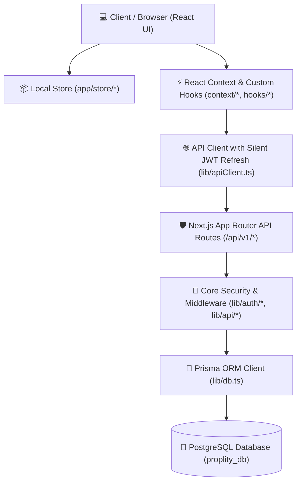

# 🏛️ Proplity — Full Project & File Structure Reference

> **Proplity** is a modern, enterprise-grade AI-powered Property Management & Tenant Experience Platform built on **Next.js 14 (App Router)**, **TypeScript**, **PostgreSQL**, and **Prisma ORM**.

---

## 🧭 High-Level Architecture Overview



---

## 🌳 Comprehensive File Tree

```
proplity/
├── 📁 app/                                   # Next.js App Router root & UI views
│   ├── 📄 App.tsx                           # Main client-side router & role-based dashboard renderer
│   ├── 📄 globals.css                       # Global Tailwind CSS tokens, animations & base styles
│   ├── 📄 layout.tsx                        # Root HTML/Body layout with theme providers
│   ├── 📄 page.tsx                          # App root entry page (renders <App />)
│   ├── 📁 api/                              # Backend REST API Route Handlers
│   │   └── 📁 v1/                           # API Version 1 endpoints
│   │       └── 📁 auth/                     # Authentication & session routes
│   │           ├── 📁 change-password/      # POST /api/v1/auth/change-password
│   │           │   └── 📄 route.ts          # Updates password & invalidates active sessions
│   │           ├── 📁 login/                # POST /api/v1/auth/login
│   │           │   └── 📄 route.ts          # Validates credentials, issues JWT & refresh cookies
│   │           ├── 📁 logout/               # POST /api/v1/auth/logout
│   │           │   └── 📄 route.ts          # Revokes refresh tokens & clears auth cookies
│   │           ├── 📁 me/                   # GET /api/v1/auth/me
│   │           │   └── 📄 route.ts          # Returns active authenticated user session profile
│   │           ├── 📁 refresh/              # POST /api/v1/auth/refresh
│   │           │   └── 📄 route.ts          # Opaque refresh token rotation with reuse detection
│   │           ├── 📁 register/             # POST /api/v1/auth/register
│   │           │   └── 📄 route.ts          # User onboarding, bcrypt hashing, verification issuance
│   │           └── 📁 verify-email/         # POST /api/v1/auth/verify-email
│   │               └── 📄 route.ts          # Token validation and account activation
│   ├── 📁 components/                       # User Interface Views & Feature Components
│   │   ├── 📁 Auth/                         # Authentication & Onboarding Views
│   │   │   ├── 📄 ForgotPassword.tsx        # Password reset initiation interface
│   │   │   ├── 📄 Login.tsx                 # User authentication form with role routing
│   │   │   └── 📄 Register.tsx              # User registration with multi-role support
│   │   ├── 📁 figma/                        # UI assets & Design System helpers
│   │   │   └── 📄 ImageWithFallback.tsx     # Smart image loader with graceful fallback support
│   │   ├── 📁 ui/                           # Radix UI + Tailwind Design System Primitives
│   │   │   ├── 📄 accordion.tsx             # Collapsible content containers
│   │   │   ├── 📄 alert.tsx                 # Status alerts and banner notices
│   │   │   ├── 📄 alert-dialog.tsx          # Modal confirmation dialogs
│   │   │   ├── 📄 aspect-ratio.tsx          # Fixed ratio media containers
│   │   │   ├── 📄 avatar.tsx                # User profile avatars with fallbacks
│   │   │   ├── 📄 badge.tsx                 # Status badges & tag indicators
│   │   │   ├── 📄 breadcrumb.tsx            # Navigation breadcrumbs
│   │   │   ├── 📄 button.tsx                # Styled button component with variants
│   │   │   ├── 📄 calendar.tsx              # Date picker calendar component
│   │   │   ├── 📄 card.tsx                  # Standard card surfaces and containers
│   │   │   ├── 📄 carousel.tsx              # Embla-powered property image carousel
│   │   │   ├── 📄 chart.tsx                 # Recharts data visualization primitives
│   │   │   ├── 📄 checkbox.tsx              # Accessible toggle checkboxes
│   │   │   ├── 📄 collapsible.tsx           # Simple collapsible panels
│   │   │   ├── 📄 command.tsx               # Command palette / searchable select
│   │   │   ├── 📄 context-menu.tsx          # Right-click contextual action menus
│   │   │   ├── 📄 dialog.tsx                # Accessible modal overlays
│   │   │   ├── 📄 drawer.tsx                # Vaul-powered bottom sliding drawers
│   │   │   ├── 📄 dropdown-menu.tsx         # Popover action dropdowns
│   │   │   ├── 📄 form.tsx                  # React Hook Form validation wrappers
│   │   │   ├── 📄 hover-card.tsx            # Context preview cards on hover
│   │   │   ├── 📄 input.tsx                 # Standard text and number inputs
│   │   │   ├── 📄 input-otp.tsx             # Pin & OTP verification input boxes
│   │   │   ├── 📄 label.tsx                 # Accessible form field labels
│   │   │   ├── 📄 menubar.tsx               # Desktop application-style menu bars
│   │   │   ├── 📄 navigation-menu.tsx       # Top navbar navigation elements
│   │   │   ├── 📄 pagination.tsx            # Page numbering and cursor controllers
│   │   │   ├── 📄 popover.tsx               # Floating trigger-anchored overlays
│   │   │   ├── 📄 progress.tsx              # Linear progress bars
│   │   │   ├── 📄 radio-group.tsx           # Radio button selection groups
│   │   │   ├── 📄 resizable.tsx             # Split resizable panel views
│   │   │   ├── 📄 scroll-area.tsx           # Custom styled scroll containers
│   │   │   ├── 📄 select.tsx                # Native-like dropdown select lists
│   │   │   ├── 📄 separator.tsx             # Visual divider lines
│   │   │   ├── 📄 sheet.tsx                 # Side-sliding overlay drawers
│   │   │   ├── 📄 sidebar.tsx               # Collapsible navigation sidebars
│   │   │   ├── 📄 skeleton.tsx              # Content loading placeholder states
│   │   │   ├── 📄 slider.tsx                # Range sliders (price/filters)
│   │   │   ├── 📄 sonner.tsx                # Toast notification toaster
│   │   │   ├── 📄 switch.tsx                # Toggle switches
│   │   │   ├── 📄 table.tsx                 # Accessible data tables
│   │   │   ├── 📄 tabs.tsx                  # Tabbed view switchers
│   │   │   ├── 📄 textarea.tsx              # Multiline text input fields
│   │   │   ├── 📄 toggle.tsx                # Single toggle buttons
│   │   │   ├── 📄 toggle-group.tsx          # Grouped toggle switches
│   │   │   ├── 📄 tooltip.tsx               # Hover micro-tooltips
│   │   │   ├── 📄 use-mobile.ts             # Screen-size responsive hook
│   │   │   └── 📄 utils.ts                  # Classnames merger (`clsx` + `twMerge`)
│   │   ├── 📄 AboutPage.tsx                 # Public company & platform about page
│   │   ├── 📄 AddTenantForm.tsx             # Staff wizard to onboard tenants and issue leases
│   │   ├── 📄 AdminBreakdownPage.tsx        # Platform-wide metrics drilldown analytics
│   │   ├── 📄 AdminDashboard.tsx            # System administrator oversight panel
│   │   ├── 📄 AdminReports.tsx              # Platform operational and financial reports
│   │   ├── 📄 AIAssistant.tsx               # Conversational AI property copilot interface
│   │   ├── 📄 Checkout.tsx                  # Paystack billing checkout & summary modal
│   │   ├── 📄 ContactPage.tsx               # Public inquiry and support contact form
│   │   ├── 📄 Dashboard.tsx                 # Property manager operations hub
│   │   ├── 📄 DashboardBreakdownPage.tsx    # Manager-level detailed metric explorer
│   │   ├── 📄 LandingPage.tsx               # Public landing page with search & value props
│   │   ├── 📄 LandlordDashboard.tsx         # Landlord financial & portfolio performance
│   │   ├── 📄 LandlordFeaturePage.tsx       # Landlord-specific marketing feature breakdown
│   │   ├── 📄 ListProperty.tsx              # Multi-step property & unit listing wizard
│   │   ├── 📄 Logo.tsx                      # Vector brand logo component
│   │   ├── 📄 MaintenanceBoard.tsx          # Kanban-style maintenance triage & dispatch board
│   │   ├── 📄 MaintenanceDetail.tsx         # Comprehensive maintenance ticket audit & chat
│   │   ├── 📄 MaintenanceRequestForm.tsx    # Tenant issue submission wizard with media upload
│   │   ├── 📄 MessagingPortal.tsx           # In-app chat messaging between tenants & staff
│   │   ├── 📄 NeighbourhoodReport.tsx       # Deep-dive intelligence report (power, flood, security)
│   │   ├── 📄 PricingPage.tsx               # Tiered subscription pricing plans
│   │   ├── 📄 PropertyApplicationForm.tsx   # Prospective tenant unit rental application
│   │   ├── 📄 PropertyDetail.tsx            # Manager/Landlord internal property overview
│   │   ├── 📄 PropertyDiscovery.tsx         # Public property search, filter & map explorer
│   │   ├── 📄 PublicPropertyDetail.tsx      # Public listing view with viewing scheduler
│   │   ├── 📄 RoleSwitcher.tsx              # Dev tool to switch perspectives (Admin, Manager, Tenant, etc.)
│   │   ├── 📄 ScheduleViewing.tsx           # Appointment booking interface with time slots
│   │   ├── 📄 ServiceProviderFeaturePage.tsx# Vendor marketing feature overview
│   │   ├── 📄 TenantDashboard.tsx           # Tenant resident portal (rent, requests, access codes)
│   │   ├── 📄 TenantDetail.tsx              # Detailed tenant profile, lease history & ledger
│   │   ├── 📄 TenantFeaturePage.tsx         # Tenant value proposition showcase
│   │   ├── 📄 TenantMaintenanceRequests.tsx # Tenant's submitted maintenance ticket status board
│   │   ├── 📄 TenantManagement.tsx          # Property manager tenant roster & compliance view
│   │   ├── 📄 TenantPaymentHistory.tsx      # Complete rent ledger, receipts & invoice tracker
│   │   ├── 📄 VendorCreateInvoice.tsx       # Vendor job completion invoicing form
│   │   ├── 📄 VendorDashboard.tsx           # Service provider job pipeline & earnings
│   │   └── 📄 VendorJobDetail.tsx           # Vendor work order details, parts cost & status updater
│   └── 📁 store/                            # Centralized Mock Datasets & State Assets
│       ├── 📄 adminBreakdownData.ts         # Mock data for admin system breakdown metrics
│       ├── 📄 adminDashboardData.ts         # Mock data for admin dashboard KPIs and health
│       ├── 📄 aiAssistantData.ts            # AI quick actions, suggestions, and responses
│       ├── 📄 dashboardBreakdownData.tsx    # Financial and occupancy chart data
│       ├── 📄 maintenanceData.ts            # Mock vendor profiles and maintenance timelines
│       ├── 📄 messagingData.ts              # Mock chat conversations and message history
│       ├── 📄 mockData.ts                   # Core mock properties, leases, payments, and stats
│       ├── 📄 propertyDetailData.ts         # Detailed mock records for demo properties
│       ├── 📄 tenantDashboardData.ts        # Mock tenant payment history and access codes
│       ├── 📄 tenantDetailData.ts           # Mock profile, lease documents, and notes
│       └── 📄 vendorJobDetailData.ts        # Mock vendor work orders, parts lists, and timelines
│
├── 📁 context/                              # Global React Context State Providers
│   └── 📄 AuthContext.tsx                   # Authentication session context & action hooks
│
├── 📁 docs/                                 # Platform Specifications & Documentation
│   ├── 📄 auth-implementation-plan.md       # Architectural specification for authentication
│   ├── 📄 auth-walkthrough.md               # Auth testing, security analysis & walkthrough
│   └── 📄 PRD.md                            # Comprehensive Product Requirements Document
│
├── 📁 hooks/                                # Custom React Hooks
│   └── 📄 useAuthRefresh.ts                 # Background multi-tab safe silent token refresh hook
│
├── 📁 lib/                                  # Shared Libraries, Security & Backend Services
│   ├── 📄 apiClient.ts                      # Axios instance with auto-refresh response interceptor
│   ├── 📄 db.ts                             # Global Prisma client instance with connection pooling
│   ├── 📄 utils.ts                          # Tailwind classnames merger utility
│   └── 📁 auth/                             # Authentication & Security Helpers
│       ├── 📄 cookies.ts                    # Path-scoped HttpOnly cookie setters and clearers
│       ├── 📄 csrf.ts                       # Origin and referer CSRF header verification
│       ├── 📄 jwt.ts                        # Edge-compatible JWT signing and verification (`jose`)
│       ├── 📄 rateLimit.ts                  # Database-backed IP/Account rate limiter
│       └── 📄 session.ts                    # Server component session extraction helper
│
├── 📁 out/                                  # Build artifacts & project workspaces
│   ├── 📄 proplity.code-workspace           # VSCode / Antigravity workspace configuration
│   └── 📄 proplity_progress.md              # Historical engineering progress tracker
│
├── 📁 prisma/                               # Database Schemas, Migrations & Seeders
│   ├── 📄 mermaid.mermaid                   # Complete Entity-Relationship Diagram (ERD)
│   ├── 📄 seed.ts                           # Standard clean database seed script
│   ├── 📄 seed2.ts                          # Enriched multi-property comprehensive seed script
│   ├── 📁 migrations/                       # SQL Migration History
│   │   ├── 📄 migration_lock.toml           # Prisma migration lockfile
│   │   └── 📁 20260821115725_init_domain_schema/
│   │       └── 📄 migration.sql             # Complete initial PostgreSQL schema DDL
│   └── 📁 schema/                           # Modular Multi-File Prisma Schemas
│       ├── 📄 audit.prisma                  # System-wide AuditLog model
│       ├── 📄 auth.prisma                   # User, VendorProfile, Note, Subscription, KYC
│       ├── 📄 base.prisma                   # Datasource & Prisma Client generator configs
│       ├── 📄 communication.prisma          # Conversation, Message, Participant models
│       ├── 📄 financial.prisma              # Invoice, Payment, AutoPayMandate models
│       ├── 📄 lease.prisma                  # Lease, Notice (renewals, increases, terminations)
│       ├── 📄 operations.prisma             # MaintenanceRequest, Category, Schedule, Rating
│       └── 📄 property.prisma               # Property, Unit, NeighbourhoodReport, AccessCode, Review
│
├── 📄 .env                                  # Environment variables (DATABASE_URL, JWT_SECRET)
├── 📄 .env.example                          # Template environment variable documentation
├── 📄 .gitignore                            # Git file ignore list
├── 📄 .prettierrc                           # Code formatting rules
├── 📄 next.config.mjs                       # Next.js framework configuration
├── 📄 next-env.d.ts                         # Next.js TypeScript declarations
├── 📄 package.json                          # Dependencies and project scripts
├── 📄 pnpm-lock.yaml                        # Pnpm dependency lockfile
├── 📄 pnpm-workspace.yaml                   # Pnpm workspace configuration
├── 📄 postcss.config.mjs                    # PostCSS / TailwindCSS v4 plugin config
├── 📄 prisma.config.ts                      # Prisma CLI configuration (schema path, URL)
├── 📄 proxy.ts                              # Dev proxy script
├── 📄 README.md                             # Project overview and getting started guide
└── 📄 tsconfig.json                         # TypeScript compiler configuration
```

---

## 📦 Key Directory Breakdown

| Directory | Purpose | Key Technologies |
|---|---|---|
| **`app/`** | Application UI & API Routes | Next.js 14 App Router, React 18, Tailwind CSS |
| **`app/api/v1/`** | Backend REST API Endpoints | Route Handlers, JWT Verification, Prisma Client |
| **`app/components/`** | Domain Feature Views & Portals | Lucide Icons, Recharts, Embla Carousel, Framer Motion |
| **`app/components/ui/`** | Design System Primitives | Radix UI, Class Variance Authority (`cva`), Sonner |
| **`app/store/`** | Centralized Mock Data Stores | Decoupled TypeScript data fixtures |
| **`context/`** | Global Client Contexts | React Context API, Axios Interceptors |
| **`hooks/`** | Custom React Hooks | Client-side reactive lifecycle utilities |
| **`lib/`** | Core Helpers & Database Services | `jose` (JWT), `pg` / `@prisma/adapter-pg`, `bcryptjs` |
| **`prisma/`** | Database Schema & Seeders | Prisma ORM v7 (Multi-File Schemas), PostgreSQL |
| **`docs/`** | Specifications & Product Docs | Product Requirements Document (PRD), Architecture Guides |

---

## 🚀 Key Scripts & Commands

```bash
# Development Server
pnpm dev                       # Start Next.js local development server (localhost:3000)

# Database Management
pnpm exec prisma db push       # Synchronize schema directly to PostgreSQL
pnpm exec prisma generate      # Compile and generate Prisma Client types
pnpm exec tsx prisma/seed.ts   # Execute standard database seeder
pnpm exec tsx prisma/seed2.ts  # Execute enriched multi-property database seeder

# Quality Assurance
pnpm exec tsc --noEmit         # Type check the entire codebase
pnpm build                     # Production bundle build & validation
pnpm format                    # Auto-format all files with Prettier
```
