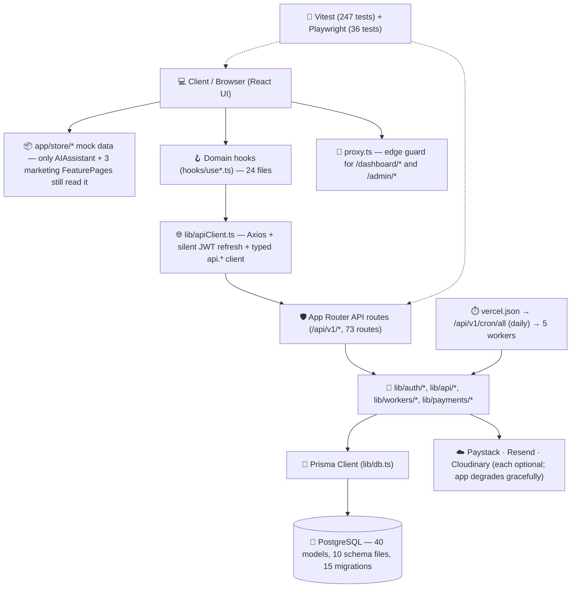

# 🏛️ Proplity — Project & File Structure Reference

> **Proplity** is an AI-assisted Property Management & Tenant Experience Platform built on **Next.js 16 (App Router)**, **TypeScript**, **PostgreSQL**, and **Prisma ORM v7**.
>
> **Last updated:** 2026-10-04, after the UI/UX gap audit (service charge, multi-unit listings, tenant profile gate, every dead `alert()` stub wired) and the auth hardening pass. Every screen is a real Next.js route backed by a real API route. For subsystem status see `CURRENT_STATE.md`; for conventions and rules see `CLAUDE.md` (authoritative).

---

## 🧭 High-Level Architecture Overview


```mermaid
graph TD
    Client["💻 Client / Browser (React UI)"]
    Store["📦 app/store/* mock data — only AIAssistant + 3 marketing FeaturePages still read it"]
    Hooks["🪝 Domain hooks (hooks/use*.ts) — 24 files"]
    ApiClient["🌐 lib/apiClient.ts — Axios + silent JWT refresh + typed api.* client"]
    Proxy["🚧 proxy.ts — edge guard for /dashboard/* and /admin/*"]
    NextApi["🛡️ App Router API routes (/api/v1/*, 73 routes)"]
    LibCore["🔑 lib/auth/*, lib/api/*, lib/workers/*, lib/payments/*"]
    PrismaClient["💎 Prisma Client (lib/db.ts)"]
    Postgres[("🐘 PostgreSQL — 40 models, 10 schema files, 15 migrations")]
    Cron["⏱️ vercel.json → /api/v1/cron/all (daily) → 5 workers"]
    Ext["☁️ Paystack · Resend · Cloudinary (each optional; app degrades gracefully)"]
    Tests["🧪 Vitest (247 tests) + Playwright (36 tests)"]

    Client --> Store
    Client --> Proxy
    Client --> Hooks
    Hooks --> ApiClient
    ApiClient --> NextApi
    NextApi --> LibCore
    LibCore --> PrismaClient
    LibCore --> Ext
    Cron --> LibCore
    PrismaClient --> Postgres
    Tests -.-> NextApi
    Tests -.-> Client
```

---

## 🌳 File Tree

```
proplity/
├── 📁 app/                                   # Next.js App Router root
│   ├── 📄 layout.tsx, error.tsx, not-found.tsx, globals.css
│   ├── 📄 page.tsx, HomeLanding.tsx         # "/" public landing; HomeLanding restores the user to ?from= after an idle-session refresh
│   │
│   ├── 📁 login/, register/, forgot-password/, reset-password/, verify-email/   # Public auth screens
│   ├── 📁 setup/                            # First-run super-admin wizard (self-disables once an admin exists)
│   ├── 📁 about/, contact/, pricing/, checkout/                                 # Public marketing + checkout
│   ├── 📁 for-landlords/, for-tenants/, for-vendors/                            # Marketing feature pages
│   ├── 📁 properties/[id]/                  # Public property detail
│   ├── 📁 dev/mock-checkout/                # Fake Paystack checkout (NEXT_PUBLIC_PAYMENTS_MOCK_ENABLED only)
│   │
│   ├── 📁 dashboard/                        # Authenticated shell for MANAGER / LANDLORD / TENANT / VENDOR
│   │   ├── 📄 layout.tsx, page.tsx
│   │   ├── 📄 DashboardChrome.tsx, MobileTabBar.tsx    # Role-based sidebar/header; mobile bottom bar shows the first 3 tabs
│   │   ├── 📁 discover/, messages/, notifications/, settings/, payment-history/, neighbourhood-report/
│   │   ├── 📁 maintenance/ (+[id]), maintenance-request/new/, tenant-maintenance/
│   │   ├── 📁 tenants/ (+add, +[id])
│   │   ├── 📁 properties/ (+new, +[id], +[id]/apply, +[id]/schedule-viewing)   # "Properties" nav = manager "My Properties"
│   │   ├── 📁 rentals/                      # Tenant "My Rentals" (current + past leases)
│   │   ├── 📁 profile/complete/             # One-time tenant profile gate
│   │   ├── 📁 vendor/jobs/[id]/ (+invoice)
│   │   └── 📁 breakdown/[type]/
│   │
│   ├── 📁 admin/                            # ADMIN-only shell
│   │   ├── 📄 layout.tsx, page.tsx, AdminChrome.tsx
│   │   ├── 📁 users/, properties/ (moderation queue), reports/, security/ (audit log), settings/ (platform settings), notifications/
│   │   └── 📁 breakdown/[type]/
│   │
│   ├── 📁 api/v1/                           # REST API — 73 route.ts files (grouped below)
│   │   ├── 📁 auth/                         # login, logout, me, refresh, register, verify-email, resend-verification, forgot-password, reset-password, change-password (10)
│   │   ├── 📁 setup/, health/               # First-run bootstrap; liveness probe
│   │   ├── 📁 properties/                   # +[id], export, moderation, units (+import, +[unitId], condition-reports, violations), reviews, viewings,
│   │   │                                    #   neighbourhood-report, ads, announcements, equipment
│   │   ├── 📁 applications/, manager-codes/ # Rental applications; landlord→manager invite codes (+check, +redeem)
│   │   ├── 📁 maintenance/                  # categories, requests (+[id], +rating), schedules
│   │   ├── 📁 leases/                       # +[id], notes, notices, sign
│   │   ├── 📁 invoices/, payments/          # payments: initialize, webhook, autopay, authorization
│   │   ├── 📁 bank-accounts/, subscriptions/ (checkout, me)
│   │   ├── 📁 access-codes/                 # +[id], verify
│   │   ├── 📁 conversations/, notifications/ # +[id]/messages; +[id], mark-all-read
│   │   ├── 📁 vendors/, uploads/sign        # Vendor reputation list; Cloudinary signature
│   │   ├── 📁 admin/                        # users, settings, audit-logs
│   │   ├── 📁 dev/                          # emails (inbox widget feed), mock-checkout/complete — both gated by env flags
│   │   └── 📁 cron/[job]/                   # rent-invoicer … and "all" (the scheduled fan-out)
│   │
│   ├── 📁 components/                       # UI views (≈45 top-level files + subfolders)
│   │   ├── 📁 Auth/                         # Login, Register, ForgotPassword
│   │   ├── 📁 notifications/                # NotificationBell, NotificationsPage
│   │   ├── 📁 dev/EmailInboxWidget.tsx      # Sent-emails panel (NEXT_PUBLIC_EMAIL_INBOX_ENABLED)
│   │   ├── 📁 figma/, ui/                   # ImageWithFallback; ~45 Radix + Tailwind primitives
│   │   ├── 📄 Marketing: LandingPage, MarketingNav, AboutPage, ContactPage, PricingPage, FeaturedPropertyModal, WatchDemoModal,
│   │   │      LandlordFeaturePage / TenantFeaturePage / ServiceProviderFeaturePage (illustrative, still on app/store mock data)
│   │   ├── 📄 Admin: AdminDashboard, AdminBreakdownPage, AdminReports
│   │   ├── 📄 Manager/Landlord: Dashboard, LandlordDashboard, DashboardBreakdownPage, TenantManagement, TenantDetail (Renew/Notice/Invoice),
│   │   │      AddTenantForm, ListProperty (multi-unit + media upload), PropertyDetail, MaintenanceBoard, MaintenanceDetail
│   │   ├── 📄 Tenant: TenantDashboard (pay rent, auto-pay), TenantPaymentHistory, TenantMaintenanceRequests, MaintenanceRequestForm,
│   │   │      PropertyDiscovery, PublicPropertyDetail, PropertyApplicationForm (3-step), CompleteProfileForm, ScheduleViewing, NeighbourhoodReport
│   │   ├── 📄 Vendor: VendorDashboard, VendorJobDetail, VendorCreateInvoice
│   │   ├── 📄 Shared: MessagingPortal, AccountSettings, Checkout, LogoutConfirmDialog, Logo, RoleSwitcher (dev only)
│   │   └── 📄 AIAssistant.tsx               # mock — no real AI backend
│   │
│   └── 📁 store/                            # Mock datasets backing only AIAssistant and the 3 marketing FeaturePages
│
├── 📁 context/AuthContext.tsx               # Session context; silent refresh on reload, exposes the extended User profile
│
├── 📁 hooks/                                # 24 files. Reads: useProperties, useLeases, useInvoices, useMaintenanceRequests, useConversations,
│   │                                        #   useVendors, useAdminUsers, useAuditLogs, useAnnouncements, useEquipment, useViolations, …
│   │                                        # Writes go through useApiSubmit (plain per-render submit — never wrap in useCallback([]))
│   ├── 📄 useApiSubmit.ts, useAuthRefresh.ts (13-min proactive refresh)
│   ├── 📄 useAutoPay.ts, useApplications.ts, useManagerCodes.ts, useBankAccounts.ts, useAdCampaigns.ts, useConditionReports.ts, useSubscription.ts
│   └── 📄 useNotifications.ts, useNotificationBell.ts, useOpenConversation.ts, useAccessCodes.ts, …
│
├── 📁 lib/
│   ├── 📄 apiClient.ts                      # Axios + 401 refresh interceptor (single-flight) + typed api.* client
│   ├── 📄 db.ts, email.ts (Resend or console), cloudinary.ts, uploadClient.ts, csv.ts, xlsx.ts, utils.ts
│   ├── 📄 notifications.ts, notificationSound.ts, subscriptions.ts, systemSettings.ts, setup.ts, appUrl.ts, safeRedirect.ts
│   ├── 📄 tenantProfile.ts                  # isTenantProfileComplete() — the profile-gate rule
│   ├── 📁 api/                              # withAuth, validate, errors, pagination, propertyAccess, types
│   ├── 📁 auth/                             # cookies, csrf, jwt, rateLimit (reserveAttempt/releaseAttempt), session
│   ├── 📁 payments/mockGateway.ts           # Paystack-shaped fake used by the mock checkout
│   └── 📁 workers/                          # rentInvoicer, overdueFlagger, maintenanceScheduleDispatcher, accessCodeExpiryJanitor, paymentReliabilityScorer, auth
│
├── 📄 proxy.ts                              # Next 16's middleware replacement — edge guard for /dashboard, /admin
├── 📁 scripts/workers/                      # CLI wrappers for the 5 workers (manual runs)
│
├── 📁 tests/
│   ├── 📁 setup/                            # globalSetup (recreate proplity_test_db, migrate, spawn next dev), loadEnv, constants
│   ├── 📁 helpers/                          # db, fixtures, auth (mint JWTs, incl. expired), client
│   ├── 📁 api/                              # 15 Vitest files — 247 tests, real HTTP against the spawned server (pnpm test)
│   └── 📁 e2e/                              # Playwright, 36 tests (pnpm test:e2e)
│       ├── 📁 smoke/                        # marketing, auth forms
│       ├── 📁 flows/                        # admin, landlord, tenant, vendor, login, session-restore, public-property-auth,
│       │                                    #   featured-properties, mock-payment, email-inbox-widget
│       ├── 📁 responsive/mobile-nav.spec.ts
│       └── 📁 helpers/auth.ts
│
├── 📁 prisma/
│   ├── 📁 schema/                           # 10 modular files (base, auth, property, lease, financial, operations, communication, notification, system, audit) — 40 models
│   ├── 📁 migrations/                       # 15 migrations, latest: 20260928092131_tenant_year_of_birth
│   ├── 📄 seed.ts, seed2.ts (enriched, used by E2E), mermaid.mermaid
│
├── 📁 docs/                                 # See "Docs map" below
├── 📁 .github/workflows/                    # ci.yml (3 jobs), migration-check, migrate-staging, migrate-production, preview, deploy-production
│
├── 📄 CLAUDE.md                             # Authoritative project reference — read first
├── 📄 CURRENT_STATE.md                      # Subsystem-by-subsystem status + changelog
├── 📄 DEPLOYMENT.md                         # Branch model, env vars, Vercel, cron, runbooks
├── 📄 README.md, PROJECT_STRUCTURE.md       # Entry point; this file
├── 📄 .env.example, .env.test.example       # Env templates (.env, .env.test are gitignored)
├── 📄 next.config.mjs, vercel.json, vitest.config.mts, playwright.config.ts, prisma.config.ts, tsconfig.json, package.json
└── 📁 out/                                  # Scratch/generator scripts (gitignored)
```

---

## 📚 Docs Map

| File                                                           | What it is                                                                                    |
| -------------------------------------------------------------- | --------------------------------------------------------------------------------------------- |
| `CLAUDE.md`                                                    | Authoritative reference: state, commands, auth architecture, conventions, known gaps          |
| `CURRENT_STATE.md`                                             | Status per subsystem, REST inventory, changelog                                               |
| `DEPLOYMENT.md`                                                | Three-tier branches, env vars, cron, migration workflows                                      |
| `docs/setup-guide.md`                                          | Installing and first-run setup for a new deployment                                           |
| `docs/flow-guide.md`                                           | How every role uses the app, step by step                                                     |
| `docs/testing-guide.md`                                        | Manual QA checklist + how to run the automated suites                                         |
| `docs/proplity-step-by-step-role-guide.md`                     | Illustrated role guide (generated from `out/scripts/generate_guide_pdf.mjs`)                  |
| `docs/PRD.md`                                                  | Product vision and requirements (incl. the AI roadmap)                                        |
| `docs/PRD-as-built.md`                                         | Same structure, but what is actually implemented today, with ✅/🟡/❌ status                  |
| `docs/auth-review-2026-09-30.md`                               | Code-level auth review whose findings were fixed in PR #21                                    |
| `docs/auth-implementation-plan.md`, `docs/auth-walkthrough.md` | Original auth design — **superseded**; see `CLAUDE.md` "Auth architecture"                    |
| `docs/development-history/phases/*.md`                         | One write-up per completed phase/feature (domain API 0–10, notifications, wizard, gap audit…) |
| `docs/development-history/*.md`                                | Roadmaps, audits, and the plans that spawned the phases                                       |

---

## 🚀 Key Scripts & Commands

```bash
pnpm dev                       # Next.js dev server (localhost:3000)
pnpm typecheck                 # tsc --noEmit (CI)
pnpm format:check              # prettier --check . (CI); pnpm format to fix
pnpm build                     # production build (CI)

pnpm db:generate               # prisma generate
pnpm db:migrate                # prisma migrate dev (interactive); db:migrate:deploy in scripts/CI
pnpm db:seed2                  # enriched multi-property seed (required by the E2E suite)

pnpm test                      # Vitest API suite (copy .env.test.example to .env.test first)
pnpm test:e2e                  # Playwright (needs a seeded DB and E2E_BASE_URL); :smoke, :flows, :ui variants

# Workers (normally run by the scheduled /api/v1/cron/all)
pnpm exec tsx scripts/workers/rentInvoicer.ts
curl -X POST localhost:3000/api/v1/cron/rent-invoicer -H "x-cron-secret: $CRON_SECRET"
```
